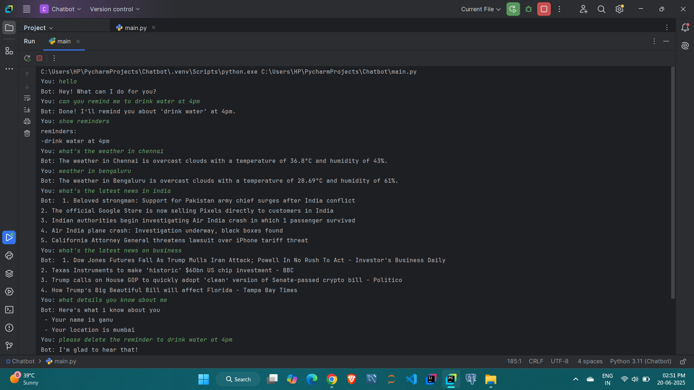
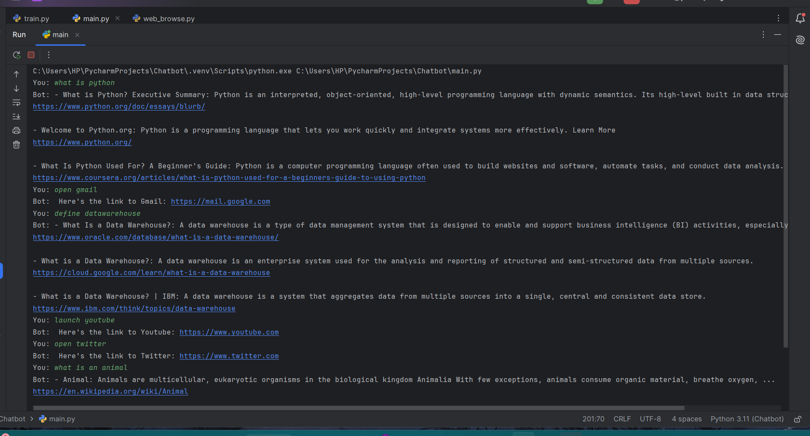

# 🤖 Chatbot Project

A smart Python-based chatbot that uses NLP and machine learning techniques to understand and respond to user queries. It can handle weather updates, news retrieval, reminders, and more — all built with modular, readable code and placeholder API keys for safe public sharing.

---

## 🚀 Features

- 🔍 **Intent Classification** using Sentence Transformers
- 😊 **Sentiment Analysis** using VADER
- 🧠 **Named Entity Recognition** with spaCy
- 📚 **Text Preprocessing** with NLTK and spaCy
- 📰 **News API Integration** *(placeholder key)*
- 🌦️ **Weather API Integration** *(placeholder key)*
- 🗓️ **Reminder Management**
- 💬 **Fallback response system** for unmatched queries
- 🛠️ **Modular Code Structure** with reusability and clarity
- 🌐 *(Planned)*: General web browsing answers
- 🧠 **Custom Intent Classification Model** trained using logistic regression and Sentence Transformers
- 📂 **Labeled Training Data** used to train spaCy NER and the ML model


---

## 🛠 Technologies Used

- **Python 3**
- **scikit-learn** – for intent classification
- **sentence-transformers**
- **NLTK**, **spaCy** – for natural language processing
- **VADER** – sentiment analysis
- **requests** – API calls
- **OpenWeatherMap & NewsAPI** – live external data (via placeholder keys)

---

## 🧠 Training Data & Models

- Intent classification is trained on a custom set of labeled sentences using `sentence-transformers` for embeddings and `LogisticRegression` from scikit-learn.
- Named Entity Recognition (NER) is enhanced using spaCy pipelines and rules for extracting names, dates, and times.
- All training scripts are organized under the `/training` directory.

---

## 📸 Chatbot Demo

Here’s a sample of the chatbot in action:




## 📁 Project Structure

chatbot-project/
├── main/ # Main chatbot logic
├── features/ # Modules: weather, news, reminders
├── fallback/ # Default fallback replies
├── memory/ # Stores user memory/context
├── nlu/ # Intent, NER, sentiment modules
├── responses/ # Pre-written responses
├── training/ # Model training scripts
├── utils/ # Helper functions
├── .gitignore # Prevents secret files from uploading

## ⚙️ How to Run

1. **Clone the Repository:**
   ```bash
   git clone https://github.com/Akashsanthosh001/chatbot-project.git
   cd chatbot-project

2. **Install Dependencies:**
   ```bash
   pip install -r requirements.txt

3. **Insert Your API Keys in the Code:**
   ```bash
    In files like:
    features/weather_api.py
    features/news_api.py
    replace
    api_key = "Your API key"

---


## 🧭 Future Plans

- Add .env support for secure secret management
- Add web search support for answering general queries
